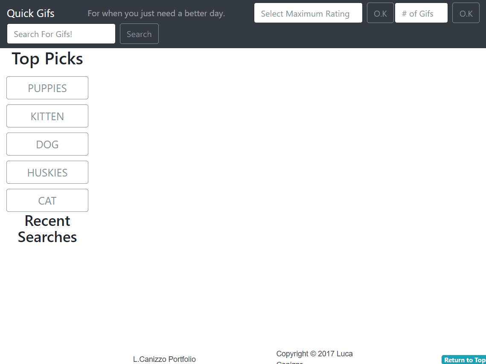
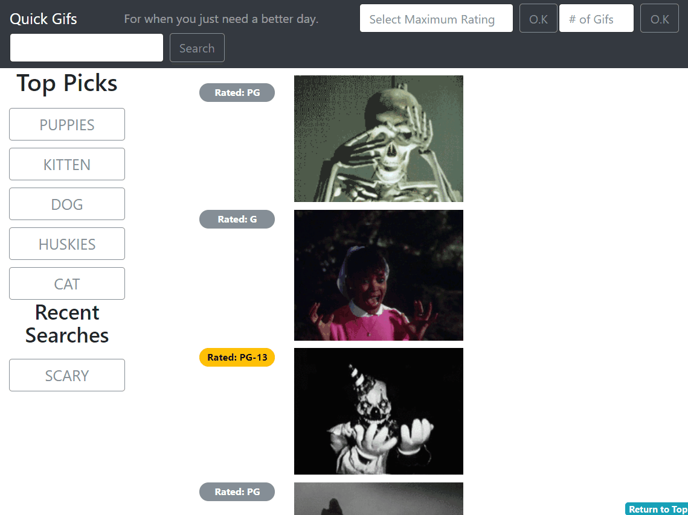
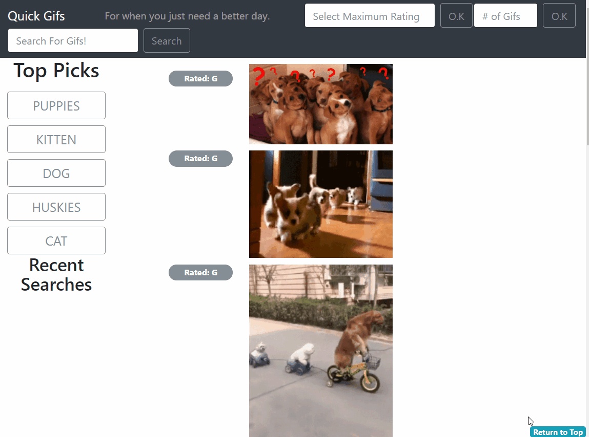

# Positive-Gifs
A responsive web app to search through Gifs with clear Gif ratings (Y, G, PG, PG-13, R)

###### This website runs api requests and dynamically replaces content based on user input, it uses:
- jQuery & jQuery UI
- Bootstrap
- CSS & html
- Giphy api

###### The focus of this website is to allow users to search for gifs in an organized manner.
- Recent user searches are logged as buttons in a subsection below recommended searches.
- Ratings for each gif are displayed to the left or above it.
    - Ratings higher than PG (PG-13 & R) are color coded:
        - PG-13 rating badges are yellow
        - R rating badges are red
- Users can update the number of gifs that will be displayed 
- Users can update the maximum rating the of the gifs that will be displayed.
- Recommended & recent searches will scroll with the page, as will the header nav containing all input elements:
    - Users can access all modifiable fields at any point in the gif-feed.

###### Program methods:
- The giphy api url is written as a constent to which the api key and search fields are added.
    - Api keys and urls can be easily adjusted.

## Demo:
#### User's can enter unique searches into the application.

#### They can also search via the applications "Top-Picks" section.

#### User's can restrict their search by the max rating they want returned.

#### If user's enter an invalid rating, they will be notified of the appropriate values and no changes to future requests will be made.

#### User's can set a limit for the number of results populated.

#### For convenience, user's can jump back to the top at any time using the "return to top" button.

#### A user's recent searches are saved temporarily, and can be reused and filtered just like a regular search.

